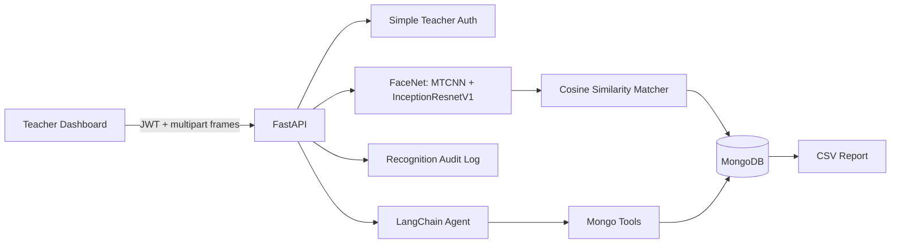

# AI Face Attendance System

Local-first facial recognition attendance app with FastAPI, MongoDB, FaceNet embeddings, LangChain query tools, and a React dashboard.

## Architecture



## Defaults and Assumptions

- No cloud face API is used. Face detection and embeddings run locally with `facenet-pytorch`.
- Embeddings are encrypted at rest in MongoDB as `face_embedding_encrypted`; raw photos are not stored.
- MongoDB Atlas Vector Search can be added later, but this implementation uses manual cosine similarity for local parity.
- Teacher auth is intentionally simple: one username/password from `.env` and JWT for API calls.
- Recognition threshold is configurable with `RECOGNITION_THRESHOLD`, default `0.60`.
- LangChain uses Ollama by default and can switch to OpenAI or Anthropic via env vars.
- Class IDs are free-text values in this prototype; a dedicated `classes` collection can be added when class scheduling is implemented.

## Project Structure

```text
backend/
  app/
    api/          FastAPI routes and auth dependencies
    agent/        LangChain agent and Mongo tools
    core/         config, JWT, encryption, rate limit
    db/           Mongo connection, repositories, reports
    models/       Pydantic schemas
    services/     face embedding, encryption, matching
  scripts/        standalone embedding extraction
frontend/         React + Vite dashboard
  Dockerfile      Production nginx container for the dashboard
models/           reserved for local model artifacts
tests/            matcher and Mongo repository tests
```

## Setup

1. Create `.env`.

```bash
cp .env.example .env
python -c "from cryptography.fernet import Fernet; print(Fernet.generate_key().decode())"
```

Paste the generated key into `EMBEDDING_ENCRYPTION_KEY`.

2. Start the full Docker stack.

```bash
docker compose up --build
```

This starts MongoDB, the FastAPI backend on `http://localhost:8000`, and the dashboard on `http://localhost:5173`.

For a non-local host, set `FRONTEND_API_BASE` in `.env` before building so the static frontend calls the correct backend URL.

3. Or run the backend locally.

```bash
python -m venv .venv
source .venv/bin/activate
pip install -r requirements.txt
uvicorn app.main:app --app-dir backend --reload
```

4. Start the frontend.

```bash
cd frontend
npm install
npm run dev
```

Open `http://localhost:5173`. Default login is `teacher` / `teacher123` unless changed in `.env`.

## Deployment Checklist

Before deploying beyond local development:

1. Set production secrets in `.env`.

```bash
cp .env.example .env
python -c "from cryptography.fernet import Fernet; print(Fernet.generate_key().decode())"
```

Update these values at minimum:

- `JWT_SECRET`: long random value, not the example value.
- `EMBEDDING_ENCRYPTION_KEY`: Fernet key generated by the command above.
- `TEACHER_USERNAME` and `TEACHER_PASSWORD`: deployment-specific credentials.
- `FRONTEND_API_BASE`: externally reachable backend URL used at frontend build time.
- `CORS_ORIGINS`: externally reachable dashboard origin allowed by FastAPI.

2. Build and start the stack.

```bash
docker compose up --build -d
```

3. Check container health.

```bash
docker compose ps
curl http://localhost:8000/health
curl http://localhost:5173/health
```

4. Review logs if any service is unhealthy.

```bash
docker compose logs -f backend
docker compose logs -f frontend
docker compose logs -f mongo
```

5. Stop the stack when needed.

```bash
docker compose down
```

Use `docker compose down -v` only when you intentionally want to delete the MongoDB volume.

## Environment Variables

| Variable | Required | Purpose |
| --- | --- | --- |
| `MONGO_URI` | Yes | MongoDB connection string. Compose overrides this to `mongodb://mongo:27017` for the backend container. |
| `MONGO_DB` | Yes | Database name. |
| `JWT_SECRET` | Yes | Signs teacher JWTs. Use a strong deployment secret. |
| `TEACHER_USERNAME` | Yes | Simple teacher login username. |
| `TEACHER_PASSWORD` | Yes | Simple teacher login password. |
| `EMBEDDING_ENCRYPTION_KEY` | Yes | Fernet key used to encrypt stored face embeddings. Keep stable across restarts. |
| `RECOGNITION_THRESHOLD` | No | Cosine similarity threshold. Defaults to `0.60`. |
| `RECOGNITION_RATE_LIMIT_PER_MINUTE` | No | Per-client recognition rate limit. Defaults to `30`. |
| `LLM_PROVIDER` | No | `ollama`, `openai`, or `anthropic`. Defaults to `ollama`. |
| `LLM_MODEL` | No | Model name for the selected provider. |
| `OPENAI_API_KEY` | Provider-specific | Needed only when `LLM_PROVIDER=openai`. |
| `ANTHROPIC_API_KEY` | Provider-specific | Needed only when `LLM_PROVIDER=anthropic`. |
| `CORS_ORIGINS` | Yes | Comma-separated dashboard origins allowed by the backend. |
| `FRONTEND_API_BASE` | Yes for Docker frontend | Backend URL baked into the static frontend image at build time. |

## Build Order Verification

### 1. Face detection + embedding extraction

```bash
PYTHONPATH=backend python backend/scripts/extract_embedding.py path/to/student.jpg --out embedding.json
```

The script outputs a normalized 512-dimensional embedding.

### 2. MongoDB schema + CRUD

Indexes are created at FastAPI startup:

- `students`: unique `(class_id, roll_no)`
- `attendance`: unique `(student_id, class_id, date)`
- `recognition_audit`: newest first

### 3-6. API

Login first:

```bash
curl -X POST http://localhost:8000/auth/login \
  -H "Content-Type: application/json" \
  -d '{"username":"teacher","password":"teacher123"}'
```

Use the returned token:

```bash
TOKEN=...
curl -X POST http://localhost:8000/enroll \
  -H "Authorization: Bearer $TOKEN" \
  -F name="Alice" \
  -F roll_no="45" \
  -F class_id="CS101" \
  -F consent=true \
  -F photo=@alice.jpg

curl -X POST http://localhost:8000/recognize \
  -H "Authorization: Bearer $TOKEN" \
  -F class_id="CS101" \
  -F frame=@frame.jpg

curl -H "Authorization: Bearer $TOKEN" \
  http://localhost:8000/attendance/CS101/2026-07-02

curl -X POST http://localhost:8000/agent/query \
  -H "Authorization: Bearer $TOKEN" \
  -H "Content-Type: application/json" \
  -d '{"query":"Who was absent in CS101 today?"}'
```

### 7. Frontend Dashboard

The React app supports:

- Teacher login
- Webcam capture and recognition overlay result
- Student enrollment with consent checkbox
- Attendance table per class/date
- Natural-language agent chat
- CSV export button

### 8. Docker

`docker-compose.yml` runs MongoDB, the backend, and the production frontend container. Health checks are configured so the frontend waits for the API and the API waits for MongoDB.

```bash
docker compose up --build
```

The frontend container serves the built React app through nginx. For deployment behind a different hostname, set:

```bash
FRONTEND_API_BASE=https://your-api-host.example.com
CORS_ORIGINS=https://your-dashboard-host.example.com
```

## API Summary

| Method | Path | Purpose |
| --- | --- | --- |
| `POST` | `/auth/login` | Teacher JWT login |
| `POST` | `/enroll` | Detect face, extract embedding, encrypt and store student |
| `POST` | `/recognize` | Detect face, match embedding, mark attendance |
| `GET` | `/attendance/{class_id}/{date}` | Attendance rows for a class/date |
| `POST` | `/agent/query` | LangChain natural language query |
| `GET` | `/report/{class_id}?start_date=YYYY-MM-DD&end_date=YYYY-MM-DD` | CSV export |

## Tests

```bash
PYTHONPATH=backend pytest
npm --prefix frontend run build
npm --prefix frontend audit --json
docker compose config
```

Tests cover embedding cosine matching and Mongo-style student/attendance/absentee queries with `mongomock-motor`.

## Deployment Notes

- The backend image installs the local ML stack, including PyTorch and `facenet-pytorch`; first builds can be slow.
- Camera access in browsers generally requires `localhost` or HTTPS.
- Raw photos are not persisted by the app, but MongoDB backups contain encrypted embeddings and should still be treated as sensitive biometric data.
- `EMBEDDING_ENCRYPTION_KEY` must not be rotated casually; changing it makes existing stored embeddings undecryptable unless you run a migration.
- Ollama is not included in `docker-compose.yml`. If `LLM_PROVIDER=ollama`, run Ollama separately and expose it to the backend environment.
